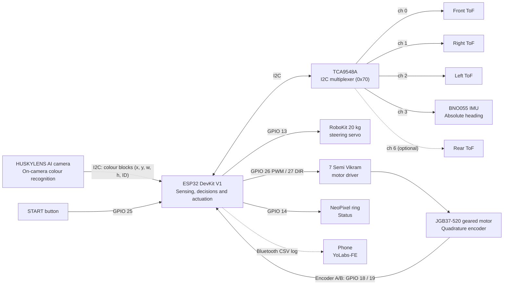
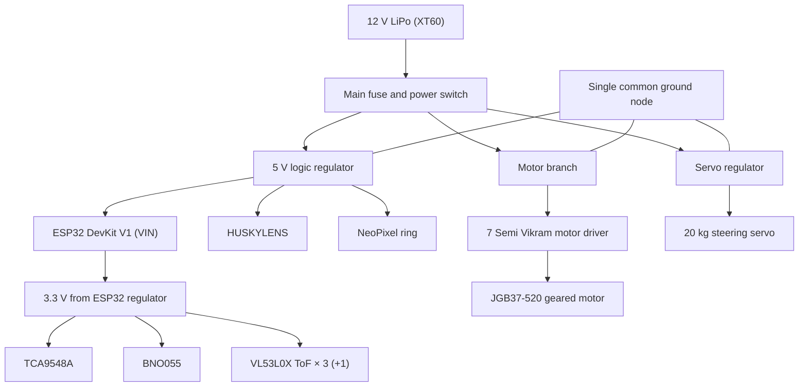
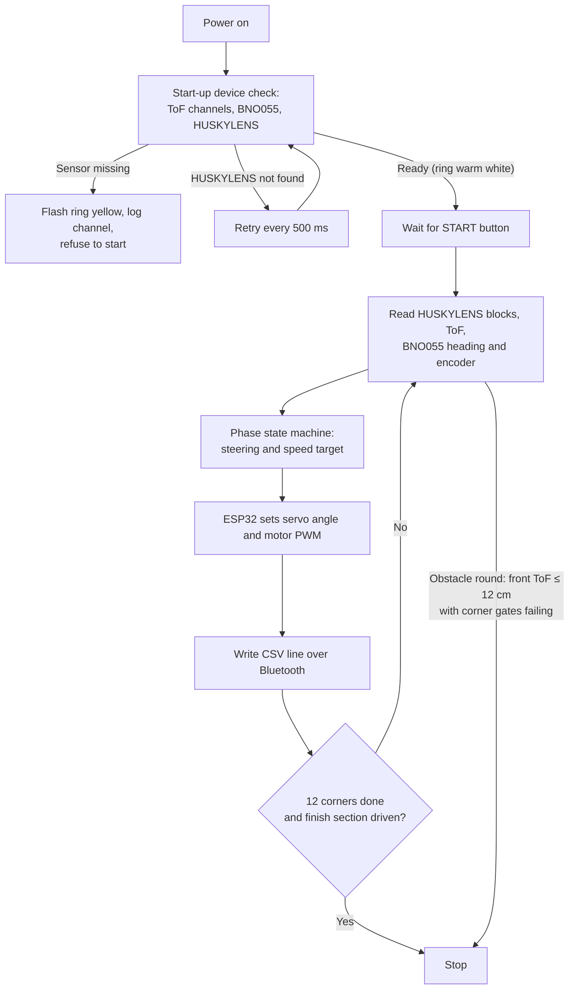

# WRO 2026 Future Engineers

## Team YO_CNTRL_ALT_DEFEAT - Version 2

| | |
| --- | --- |
| **Team name** | YO_CNTRL_ALT_DEFEAT |
| **Team ID** | 1680 |
| **Team members** | Abhay and Nidhella |
| **Country / region** | India |
| **Season** | 2026 - Future Engineers |

This repository documents Version 2 of the YO_CNTRL_ALT_DEFEAT autonomous vehicle for WRO Future Engineers. V2 is a rear-wheel-drive vehicle with servo-driven front-wheel steering and a mechanical rear differential. A **single ESP32 DevKit V1** runs every real-time task. It reads three VL53L0X time-of-flight (ToF) sensors (plus an optional rear sensor) through a TCA9548A I2C multiplexer, takes heading from a BNO055 IMU, measures distance from a quadrature encoder on a JGB37-520 geared motor, and drives the steering servo and motor driver. Colour recognition is handled on board by a **HUSKYLENS AI camera**, which reports coloured blocks to the ESP32 over I2C. No separate vision computer is carried on V2.

## V1 baseline

<p align="center">
  
</p>

<p align="center"><em>Version 1 prototype. This image remains as the visual baseline for the V2 design record.</em></p>

| Area | V2 implementation | Measured evidence |
| --- | --- | --- |
| Mobility | Rear-wheel drive through a mechanical differential, servo-driven front-wheel steering | Open round 23/25 successful runs; heading error after each corner ±2-4° |
| Feedback | Quadrature encoder, BNO055 IMU, 3 × VL53L0X ToF (+1 optional rear) | Encoder calibration ±2 ticks per metre; ToF ±7-10 cm at 2 m |
| Compute | Single ESP32 DevKit V1 + HUSKYLENS AI camera (on-camera colour recognition) | Start-up device check; pillar pass rate 44/50 |
| Fabrication | Acrylic chassis plate with 3D-printed PETG mounts from the STL library | Fitted STL set recorded in the engineering documentation (§2.6) |

## Documentation

| Resource | Purpose |
| --- | --- |
| [Engineering documentation](docs/) | Full V2 engineering documentation (PDF): design rationale, pin map, calibration, strategy, test results |
| [V2 engineering journal](docs/V2_ENGINEERING_JOURNAL.md) | Design rationale, V1-to-V2 change log, risks and validation plan |
| [`Codes/`](Codes/) | Competition programs for the open and obstacle rounds (ESP32) |
| [V2 STL library](hardware/STL_V2/) | 31 supplied STL files and fabrication notes |
| [V2 electronics reference](hardware/ELECTRONICS_V2/) | Component architecture, wiring rules and bench-test worksheet |
| [Bill of materials](hardware/) | `Yo_Cntrl_Alt_Defeat BOM.csv` |
| [Robot photographs](media/images/v2/) | V2 robot views and wiring photograph |
| [Mock run video](media/videos/) | `v2-MockRun-OpenRound.mp4` |
| [`src/`](src/) | Earlier code snapshots |

## V2 system architecture



V2 has one programmable controller. The HUSKYLENS is treated as a smart sensor: it captures frames, runs the trained colour-recognition model, and returns a short list of coloured blocks with their position, size and learned ID. The ESP32 requests these blocks every loop, filters them by shape, reads the ToF sensors, IMU and encoder, runs the open-round and obstacle-round state machines, drives the servo and motor, and logs every loop over Bluetooth.

## V1 and V2 comparison

| Area | V1 prototype | V2 robot | Why it matters |
| --- | --- | --- | --- |
| Vision | Separate vision computer + camera with OpenCV, commands sent over UART | HUSKYLENS AI camera on the ESP32 I2C bus | One controller owns the whole decision; no serial link to fail; colour model trained on the field |
| Distance sensing | Three HC-SR04 ultrasonic sensors, 5 V ECHO dividers | 3 × VL53L0X ToF (+ optional rear) via TCA9548A | Narrow beam, 3.3 V native, continuous ranging, no level shifting |
| Drive | BO motor, time-based distance | JGB37-520 geared motor + quadrature encoder, rear differential | Distance in millimetres; stall detection; smoother cornering |
| Heading | Basic / none | BNO055 absolute heading with PD control | Straight legs and exact 90° corners |
| Power | 9 V supply, one buck converter | 12 V LiPo, separate motor, servo and logic branches | Motor and servo surges kept off the logic rail |
| Run feedback | USB serial only | Bluetooth CSV log ("YoLabs-FE") + NeoPixel status ring | Every practice run produces data for tuning |
| Mechanical platform | Prototype steering chassis | Acrylic chassis plate with 3D-printed PETG mounts and bearing supports | Improved alignment and easier component replacement |

## Advantages of V2

1. The encoder and BNO055 IMU make every manoeuvre distance- and heading-based, so battery voltage no longer changes where the robot turns.
2. Narrow-beam ToF sensors at the front, left and right (plus an optional rear sensor) measure the wall they point at, not the nearest object in a wide acoustic cone.
3. The rear differential lets each rear wheel turn at its own speed in corners, reducing tyre scrub and heading disturbance with only one motor, one driver and one encoder.
4. Separate motor, servo and logic power branches stop motor or steering surges from browning out the ESP32 or the HUSKYLENS.
5. Moving colour recognition into the HUSKYLENS removes the second computer, its boot sequence and the serial link, so there are fewer failure points at the start line.
6. Colours are learned on the actual field with a button press, so re-training under venue lighting takes minutes.
7. Every loop is logged as a CSV line over Bluetooth, so each practice run leaves data for tuning.

## Hardware list

| Item | Qty | Role in the robot |
| --- | --- | --- |
| HUSKYLENS AI camera | 1 | Colour recognition of red / green traffic signs and blue / orange corner lines |
| ESP32 DevKit V1 | 1 | Single real-time controller; Bluetooth logging |
| VL53L0X time-of-flight sensor | 3 (+1) | Front, right and left distance; optional rear sensor for corner reverse |
| TCA9548A I2C multiplexer | 1 | Gives each same-address VL53L0X (and the IMU) its own channel |
| BNO055 9-axis IMU | 1 | Absolute heading for straight-line and corner control |
| JGB37-520 DC geared motor (120 RPM) | 1 | Rear-wheel propulsion |
| Quadrature motor encoder | 1 | Distance travelled and stall detection |
| Mechanical differential + drive shafts | 1 + 2 | Splits drive to the rear wheels while allowing different speeds in turns |
| RoboKit 20 kg high-torque servo | 1 | Front-wheel steering |
| 7 Semi Vikram motor driver | 1 | PWM speed and direction control of the drive motor |
| 12 V LiPo battery | 1 | Primary energy source (XT60 connector) |
| Voltage regulators (5 V logic, servo) | 2 | Separate logic and servo supplies |
| WS2812B NeoPixel ring, 16 LED | 1 | Run-state and fault indication |
| START push-button, power switch | 1 + 1 | Run start / stop; master isolation |
| Wheels / tyres | 4 | Traction (large rear, small front) |
| Acrylic chassis plate + 3D-printed mounts | 1 set | Structure |
| Jumper wires, power cables, perfboard | as required | Interconnection |

## Image record
> **V2 front-left view**<br>


> **V2 top view**<br>


> **V2 right-side view**<br>
 

> **V2 back**<br>


> **V2 wiring view**<br>


## Electrical power flow



The servo is never powered from the ESP32 or from the 5 V logic rail, because a 20 kg servo stalling at full lock can pull enough current to brown out the ESP32 and reset the run. Battery, motor driver, both regulators, ESP32, servo, HUSKYLENS and all I2C sensors share one ground node. Before integration, verify polarity, measure each regulator output with no load, and confirm that every I2C device answers while PWM is active.

## ESP32 pin assignment

| Component | Connection | ESP32 pin |
| --- | --- | --- |
| Motor driver IN1 | Speed / PWM | GPIO 26 |
| Motor driver IN2 | Direction | GPIO 27 |
| Steering servo | Signal (50 Hz PWM, 500-2400 µs) | GPIO 13 |
| Encoder channel A | Interrupt, rising edge | GPIO 18 |
| Encoder channel B | Direction input | GPIO 19 |
| START button | Input, internal pull-up, active low | GPIO 25 |
| NeoPixel ring | Data in | GPIO 14 |
| I2C SDA | HUSKYLENS + TCA9548A | GPIO 21 (default) |
| I2C SCL | HUSKYLENS + TCA9548A | GPIO 22 (default) |
| Common ground | GND | ESP32 GND |

SDA / SCL are not set explicitly in the code (`Wire.begin()`), so the DevKit V1 defaults GPIO 21 / 22 apply. The I2C bus runs at 100 kHz.

**TCA9548A channels:** ch 0 → front ToF, ch 1 → right ToF, ch 2 → left ToF, ch 3 → BNO055, ch 6 → rear ToF (optional). The HUSKYLENS sits on the main bus, which stays connected whatever channel is selected.

## HUSKYLENS colour IDs

| ID | Colour | Field element | Used for |
| --- | --- | --- | --- |
| 1 | Blue | Corner line | Corner confirmation (line gate) |
| 2 | Orange | Corner line | Corner confirmation (line gate) |
| 3 | Magenta | Parking-lot marker | Logged only |
| 4 | Red | Traffic sign | Pass on the right |
| 5 | Green | Traffic sign | Pass on the left |

Learn each colour ID on the actual field under the venue lighting before running.

## Program set

Each round has its own program in [`Codes/`](Codes/), so a change for one round cannot break the other. All tuning constants are `#define` values at the top of each program.

| File | Round | Status | Summary |
| --- | --- | --- | --- |
| `01_Complete_Open_Round_CW_CCW.ino` | Open | Competition | Heading PD + wall centring, ToF corner detection, auto CW / CCW lock, 12 turns then finish |
| `03_Obstacle_Round_With_Parking_Out_Corrected.ino` | Obstacle | Competition | Parking exit, pillar bulges, gated precision corners, optional rear-ToF reverse |
| `02_Obstacle_Round_No_Parking_Slow_Accurate.ino` | Obstacle | Fallback | Same strategy at PWM 70, no parking exit |

To flash a program, open the `.ino` file in the Arduino IDE with ESP32 board support, select the ESP32 DevKit V1 board, install the libraries listed in the program header (including the DFRobot HUSKYLENS library), and upload over USB.

## Control flow



The camera decides **what** to do (which side to pass a pillar, whether a corner line is present). The ToF sensors and encoder decide **when** and **whether it is safe**: a camera detection cannot start a corner without the distance, side and front gates, and the front ToF can stop the run whatever the camera sees.

## Measured test results

| Test | Method | Metric | Result |
| --- | --- | --- | --- |
| ToF accuracy | Flat target at a known distance of 2 m | Error in cm per channel | ±7-10 cm |
| Encoder calibration | Push 1 m along a straight edge | Ticks per metre | ±2 |
| Straight-line hold | Drive 2 m on heading PD | Lateral drift (°) | 5-10° |
| Corner accuracy | 12 corners in the open round | Heading error after each turn (°) | ±2-4° |
| Open-round reliability | Repeated full runs, CW and CCW | Successful runs / attempts | 23/25 |
| Pillar pass rate | Red and green pillars at all positions | Correct-side passes / attempts | 44/50 |
| Obstacle-round reliability | Full runs with random layouts | Successful runs / attempts | 12/20 |
| Parking exit | Repeated exits left and right | Clean exits / attempts | 14/15 |

## Build and validation flow


## Repository structure

```text
README.md                         Main documentation
Codes/                            Competition programs (01, 02, 03) for the ESP32
docs/                             Engineering documentation (PDF) and V2 engineering journal
hardware/ELECTRONICS_V2/          Electronics reference and electrical validation plan
hardware/STL_V2/                  Printable STL parts + README
hardware/Yo_Cntrl_Alt_Defeat BOM.csv  Bill of materials
media/images/v2/                  Robot photographs
media/videos/                     v2-MockRun-OpenRound.mp4
src/                              Earlier code snapshots
```

## Build and bring-up procedure

Following this order means a fault is found while only one subsystem is connected. Section numbers (§) refer to the [engineering documentation](docs/).

1. Assemble the chassis, steering linkage, differential and motor mount; check the wheels turn freely and the steering does not bind at either lock.
2. Wire the common ground first, before any supply rail.
3. Power the regulators alone from the battery and set / measure each output before connecting any load.
4. Connect the ESP32 by USB only; flash a test and confirm Bluetooth logging reaches the phone.
5. Connect the I2C bus: HUSKYLENS, TCA9548A, ToF sensors and BNO055. Flash a program and confirm the start-up check passes (ring turns warm white).
6. Calibrate ToF offsets, encoder ticks per metre and servo centre (§3.9).
7. Learn the colour IDs on the HUSKYLENS on the field (§3.13).
8. With the wheels lifted, check motor direction, encoder sign and servo direction.
9. Run program `01_Complete_Open_Round_CW_CCW.ino` on the field at reduced speed, then at full speed, both directions.
10. Run program `03_Obstacle_Round_With_Parking_Out_Corrected.ino`, first without pillars, then with pillars; record the metrics from the Bluetooth log and note any changes made.

## Before a field run

1. Confirm the fitted STL parts match the actual motor, servo, bearings, differential and sensor boards.
2. Check that the steering has no mechanical bind and the wheels move freely.
3. Check the LiPo voltage, battery polarity (XT60), fuse, common ground and motor-driver current capacity.
4. Re-learn the HUSKYLENS colour IDs under the venue lighting.
5. Power on and confirm the start-up device check passes (ring turns warm white) and the Bluetooth log reaches the phone.
6. Load the saved calibration values and make a backup before changing gains.

## Security and configuration

Keep GitHub tokens, Wi-Fi passwords and event credentials out of tracked files. Use a local ignored configuration file and commit only a placeholder example.

<details>
<summary>V1 prototype reference (historical - superseded by V2 above)</summary>

> This section describes the earlier V1 robot (Raspberry Pi vision, HC-SR04 ultrasonic sensors, BO motor). It is kept for the design record only and does not describe the V2 hardware.

# Obstacle-Avoiding Robot

A rear-wheel-drive autonomous robot with front-wheel steering, three ultrasonic distance sensors, and Raspberry Pi computer vision. The Raspberry Pi uses a camera and OpenCV to detect obstacles/colours and sends high-level commands such as `dodgeRight()` and `dodgeLeft()` to an ESP32 over serial/UART. The ESP32 handles ultrasonic sensing, steering, and motor control.

## 1. System Architecture

```text
                 ┌──────────────────────┐
                 │     RASPBERRY PI     │
                 │                      │
                 │ Camera + OpenCV      │
                 │ Obstacle/colour      │
                 │ decision making      │
                 └──────────┬───────────┘
                            │
                       Serial / UART
                            │
                            ▼
                 ┌──────────────────────┐
                 │        ESP32         │
                 │                      │
                 │ Ultrasonic sensing   │
                 │ Servo steering       │
                 │ Motor control        │
                 └───────┬───────┬──────┘
                         │       │
              ┌──────────┘       └───────────┐
              ▼                              ▼
       ┌─────────────┐                ┌─────────────┐
       │ Servo motor │                │ Motor driver│
       │ Front steer │                │             │
       └─────────────┘                └──────┬──────┘
                                            │
                                            ▼
                                       Rear BO motor
                                       + rear wheels
```

The Raspberry Pi performs high-level visual processing. The ESP32 is responsible for real-time interaction with the physical hardware.

## 2. Main Hardware

- Raspberry Pi
- Raspberry Pi camera module
- ESP32 development board
- 3 × HC-SR04 ultrasonic sensors
- Servo motor for front-wheel steering
- BO motor
- Compatible single-channel motor driver with IN1, IN2 and ENA/PWM inputs
- 9 V battery/supply
- 9 V → 5 V buck converter
- Front steering mechanism and chassis
- Rear wheels connected to the BO motor
- Resistors for ultrasonic ECHO voltage dividers: 1 kΩ and 2 kΩ for each sensor
- Jumper wires and suitable power wiring

## 3. ESP32 Pin Connections

| Component | Connection | ESP32 pin |
|---|---|---|
| Front ultrasonic TRIG | TRIG | GPIO 13 |
| Front ultrasonic ECHO | ECHO | GPIO 34 |
| Left ultrasonic TRIG | TRIG | GPIO 14 |
| Left ultrasonic ECHO | ECHO | GPIO 35 |
| Right ultrasonic TRIG | TRIG | GPIO 25 |
| Right ultrasonic ECHO | ECHO | GPIO 32 |
| Motor driver IN1 | Motor control | GPIO 18 |
| Motor driver IN2 | Motor control | GPIO 19 |
| Motor driver ENA | PWM/speed | GPIO 15 |
| Servo signal | PWM | Use a free suitable GPIO |
| Common ground | GND | ESP32 GND |

GPIO 34 and GPIO 35 are input-only pins, which is appropriate for the ultrasonic ECHO signals.

## 4. Ultrasonic Sensor Wiring

Each HC-SR04 is connected as follows:

```text
HC-SR04 VCC  → 5 V
HC-SR04 GND  → GND
HC-SR04 TRIG → assigned ESP32 GPIO
HC-SR04 ECHO → voltage divider → assigned ESP32 GPIO
```

The HC-SR04 ECHO output can be approximately 5 V, while ESP32 GPIO is designed for 3.3 V logic. Do **not** connect a 5 V ECHO signal directly to an ESP32 input.

Use one voltage divider for every ECHO line:

```text
HC-SR04 ECHO
     │
    1 kΩ
     │
     ├────────────→ ESP32 ECHO GPIO
     │
    2 kΩ
     │
    GND
```

This produces approximately 3.3 V from a 5 V ECHO signal.

Make three identical dividers:

- Front ECHO → GPIO 34
- Left ECHO → GPIO 35
- Right ECHO → GPIO 32

The sensors should be physically positioned so that one faces forward and the other two face left and right.

```text
                    FRONT
                      ↑
                [FRONT SENSOR]

          [LEFT]                 [RIGHT]
          SENSOR                  SENSOR

                 ┌─────────┐
                 │  ROBOT  │
                 └────┬────┘
                      │
                   BO MOTOR
```

## 5. Power System

The 9 V supply powers the motor circuit and is also reduced to 5 V for the servo and ultrasonic sensors.

```text
                 9 V BATTERY
                ┌──────┴──────┐
                │             │
                ▼             ▼
          Motor driver    Buck converter
          motor supply       9 V → 5 V
                              │
                    ┌─────────┴─────────┐
                    ▼                   ▼
                 Servo VCC        Ultrasonic VCC
```

The ESP32 may be supplied through its appropriate 5 V/VIN input if the board and regulator specifications permit it. Check the exact ESP32 development board before connecting power.

All grounds must be common:

```text
Battery GND
   ├── Motor driver GND
   ├── Buck converter GND
   ├── ESP32 GND
   ├── Servo GND
   └── Ultrasonic GND
```

A common ground is essential because the ESP32 control signals need the same voltage reference as the devices receiving those signals.

## 6. Servo Wiring

The servo controls the front steering mechanism:

```text
Buck +5 V   → Servo VCC
Buck GND    → Servo GND
ESP32 GPIO  → Servo SIGNAL
```

Do not power the servo from an ESP32 GPIO. Steering against mechanical resistance can cause the servo to draw significant current, so the 5 V buck converter should supply the servo.

## 7. Motor Driver Wiring

The ESP32 controls the rear BO motor through the motor driver:

```text
ESP32 GPIO 18 ─────→ Motor driver IN1
ESP32 GPIO 19 ─────→ Motor driver IN2
ESP32 GPIO 15 ─────→ Motor driver ENA/PWM
ESP32 GND ──────────→ Motor driver GND

9 V battery ────────→ Motor driver motor-power input

Motor driver OUT1 ──→ BO motor
Motor driver OUT2 ──→ BO motor
```

The exact power and output terminals depend on the motor-driver module. Verify its pin labels and voltage/current ratings before connecting the motor.

Example ESP32 definitions:

```cpp
#define MOTOR_PIN_1 18
#define MOTOR_PIN_2 19
#define ENA 15
```

## 8. Raspberry Pi and Camera

Connect the camera module to the Raspberry Pi using the appropriate camera connector and configure the Raspberry Pi camera software for the installed operating system.

The software flow is:

```text
Camera
   ↓
Image capture
   ↓
OpenCV processing
   ↓
Obstacle/colour detection
   ↓
High-level decision
   ↓
"dodgeRight()" / "dodgeLeft()"
   ↓
UART/Serial
   ↓
ESP32
```

OpenCV can be used for image preprocessing, colour detection, contour/object detection, and other required vision operations. The exact OpenCV algorithm depends on the type of obstacle or colour that must be detected.

## 9. Raspberry Pi–ESP32 Communication

A serial/UART connection is used to transfer commands from the Raspberry Pi to the ESP32.

A simple command protocol can be used, for example:

```text
RIGHT
LEFT
FORWARD
STOP
```

The Raspberry Pi sends the command after processing the camera image. The ESP32 receives the command and calls the corresponding control routine.

If physical UART pins are used, connect TX of the transmitting device to RX of the receiving device and RX to TX, with a common ground. Confirm the voltage levels and UART configuration of the specific Raspberry Pi and ESP32 setup before wiring.

## 10. Obstacle-Avoidance Logic

The three ultrasonic sensors provide spatial information around the robot.

For example:

```text
Left   = 15 cm
Front  = 20 cm
Right  = 80 cm
```

The right side has substantially more free space, so the robot can select a right-hand avoidance manoeuvre.

Another example:

```text
Left   = 80 cm
Front  = 20 cm
Right  = 15 cm
```

The left side has more clearance, so the robot can select a left-hand manoeuvre.

If an obstacle is directly ahead:

```text
Left   = 60 cm
Front  = 15 cm
Right  = 55 cm
```

the obstacle is primarily in the forward path, and the left/right distances can be compared to select the clearer direction.

A single ultrasonic sensor would only provide information about the distance in one direction. Three sensors allow the ESP32 to compare available clearance on both sides and make a more useful steering decision.

## 11. Control Responsibilities

The Raspberry Pi and ESP32 have separate responsibilities.

**Raspberry Pi**
- Captures camera images
- Runs OpenCV
- Detects obstacles/colours
- Makes high-level vision decisions
- Sends avoidance commands

**ESP32**
- Reads the three ultrasonic sensors
- Determines local obstacle clearance
- Controls the motor driver
- Controls the steering servo
- Executes commands received from the Raspberry Pi

This separation keeps computationally intensive vision processing on the Raspberry Pi while keeping time-sensitive hardware control on the ESP32.

## 12. Why This Architecture Works

The robot combines camera-based vision with direct distance measurement. The camera provides visual information that ultrasonic sensors cannot provide, while ultrasonic sensors provide direct proximity information that does not depend on image interpretation.

Front-wheel steering separates steering from propulsion:

```text
Servo → front-wheel steering
BO motor → rear-wheel propulsion
```

This makes the physical control system straightforward: the ESP32 changes the servo angle to steer while the motor driver controls the rear BO motor.

Before powering the complete system, verify polarity, common ground, regulator output voltage, motor-driver ratings, servo current requirements, and the 3.3 V limitation of ESP32 GPIO inputs. Test the motor, servo, and each ultrasonic sensor separately before running the complete obstacle-avoidance program.

</details>
