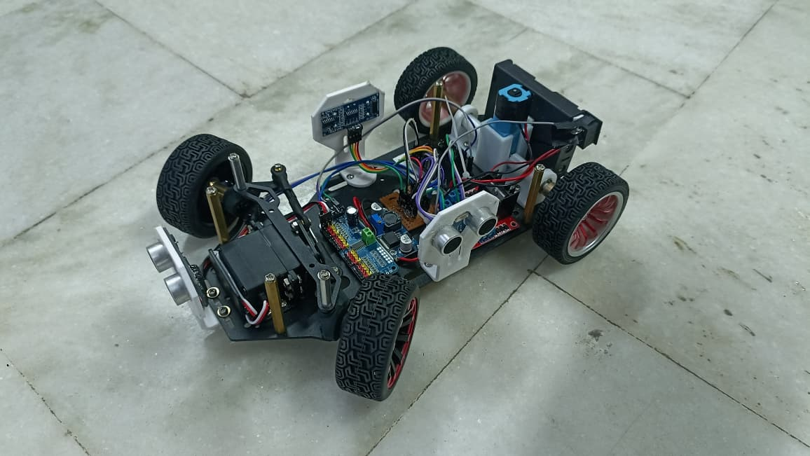
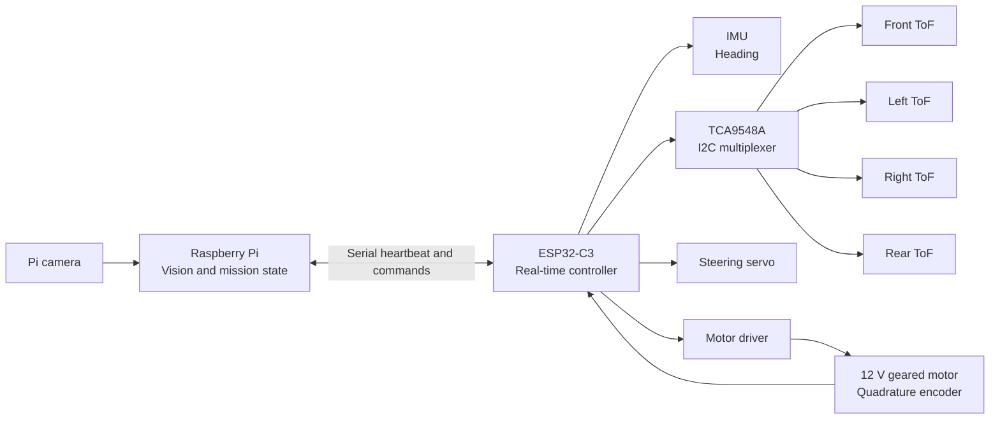
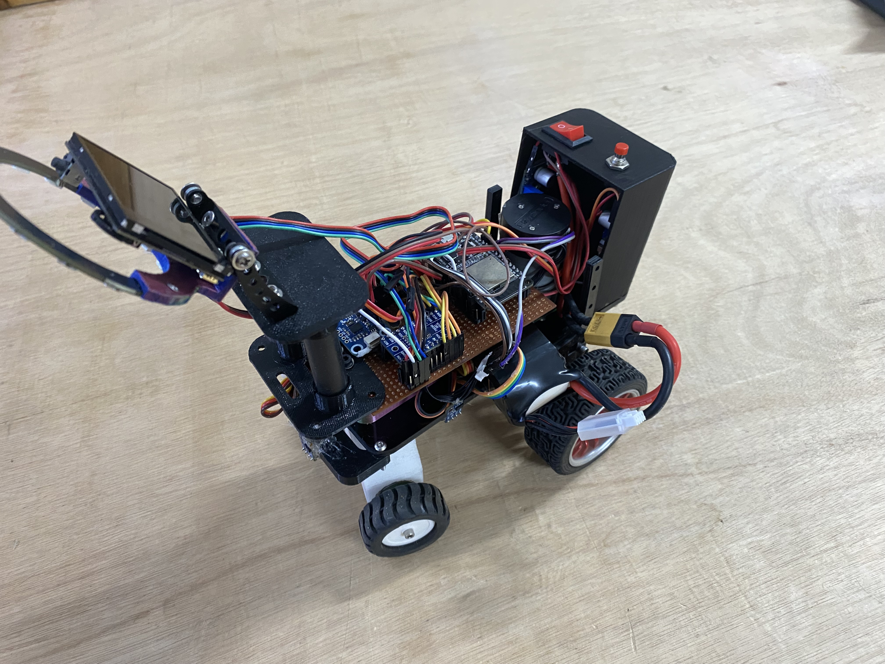
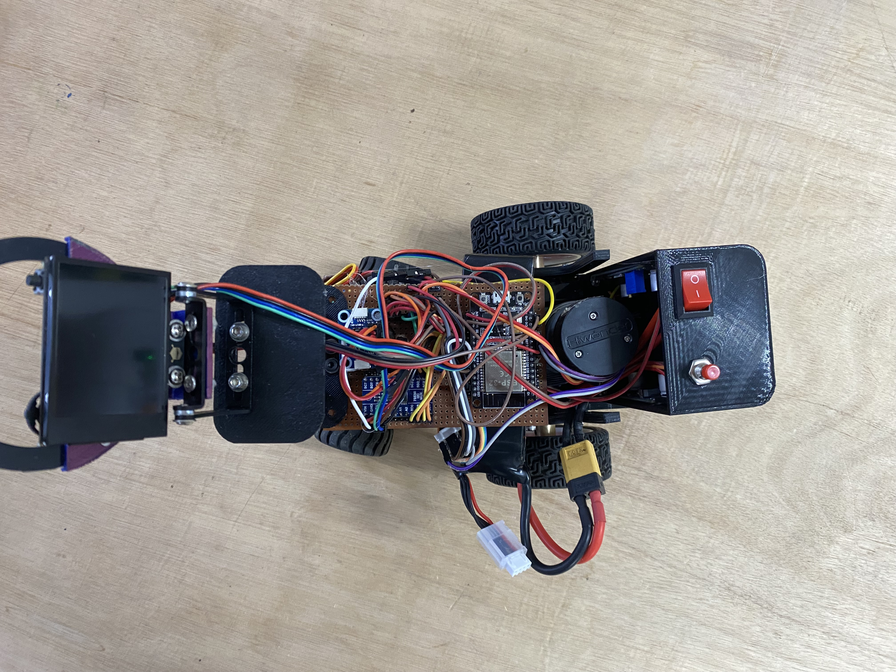
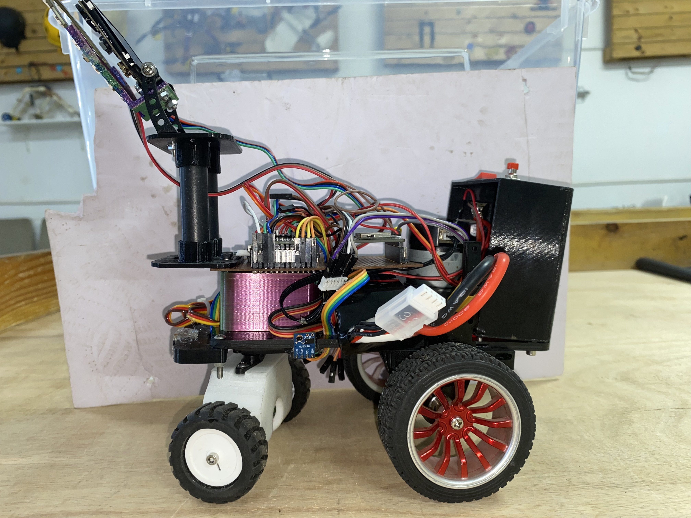
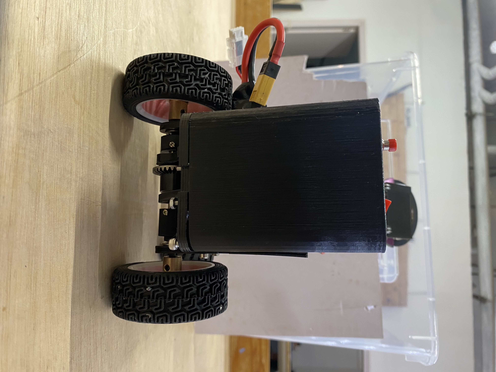
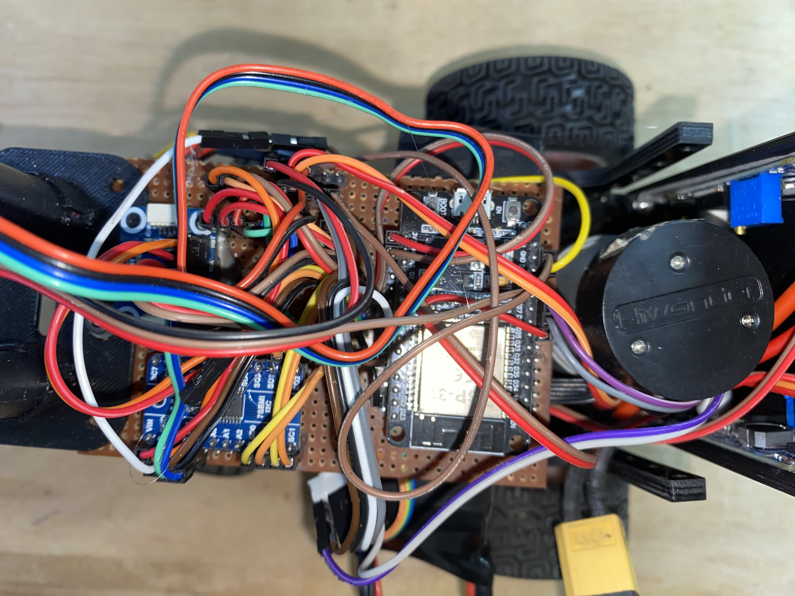
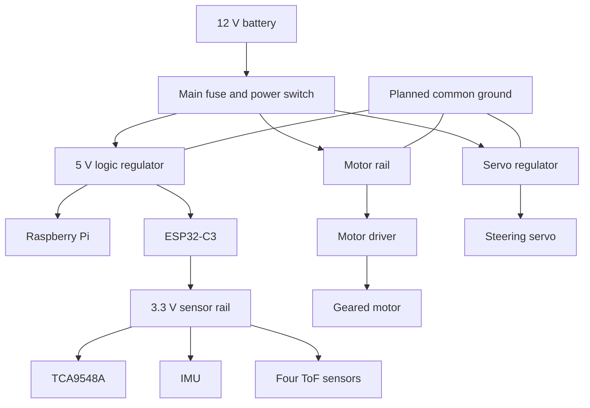
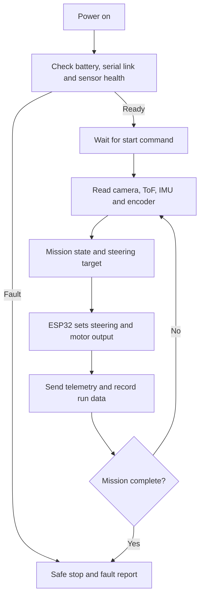

# WRO 2026 Future Engineers

## Team YO_ERROR-404 - Version 2

This repository documents Version 2 of the YO_ERROR-404 autonomous vehicle for WRO Future Engineers. V2 develops the earlier prototype into a serviceable differential-drive platform with encoder feedback, short-range ToF sensing, a Raspberry Pi vision system and an ESP32-C3 real-time controller.

## V1 baseline

<p align="center">
  
</p>

<p align="center"><em>Version 1 prototype. This image remains as the visual baseline for the V2 design record.</em></p>

| Area | V2 direction | Current evidence required |
| --- | --- | --- |
| Mobility | Rear differential with front parallel steering | Roll, steering-sweep and coupling test |
| Feedback | Encoder, IMU and four ToF channels | Saved calibration values and bench logs |
| Compute | Raspberry Pi vision + ESP32-C3 real-time control | Stable serial heartbeat and safe stop |
| Fabrication | STL-only release for printed parts | Chosen STL revision and physical dry-fit |

## Documentation

| Resource | Purpose |
| --- | --- |
| [V2 engineering journal](docs/V2_ENGINEERING_JOURNAL.md) | Design rationale, V1-to-V2 change log, risks and validation plan |
| [V2 STL library](hardware/STL_V2/) | 31 supplied STL files and fabrication notes |
| [V2 electronics reference](hardware/ELECTRONICS_V2/) | Component architecture, wiring rules and bench-test worksheet |
| [Image placeholders](media/images/v2/README.md) | Required robot photographs for the final journal |
| [`src/`](src/) | Existing ESP32 and Raspberry Pi software snapshot |

## V2 system architecture



The Raspberry Pi makes high-level vision and navigation decisions. The ESP32-C3 reads feedback, drives the steering and motor outputs, reports telemetry and stops propulsion when a safety condition occurs.

## V1 and V2 comparison

| Area | V1 prototype | V2 development | V2 advantage to validate |
| --- | --- | --- | --- |
| Drivetrain | BO motor and lightweight rear drive | 12 V geared motor, encoder and rear differential | Measured speed and distance feedback with stronger mechanical support |
| Distance sensing | Three HC-SR04 ultrasonic sensors | Four ToF channels through TCA9548A | Narrower, repeatable short-range wall measurements |
| Heading and distance control | Time-based corrections with basic IMU feedback | Encoder, IMU and ToF feedback used together | Corrections can use measured error instead of timing alone |
| Power architecture | General 9 V supply path | Dedicated motor, servo, logic and sensor domains | Better isolation from motor and servo noise |
| Mechanical platform | Prototype steering chassis | Polycarbonate chassis with PETG mounts and bearing supports | Improved alignment and easier component replacement |
| Compute split | Raspberry Pi and ESP32 prototype control | Explicit Raspberry Pi mission layer and ESP32 safety/control layer | Cleaner separation of vision work from real-time actuation |

## Advantages of V2

1. The encoder and IMU provide a measurable calibration path for straight runs, turns and speed control.
2. Four ToF sensor positions can provide front, side and rear distance evidence when their mounts and offsets are validated.
3. The differential drivetrain and reinforced mounts are designed for better wheel alignment and serviceability.
4. Dedicated power domains reduce the chance that motor or steering load interrupts the Raspberry Pi or sensor bus.
5. The V2 journal, STL library and image plan make the build easier to inspect, reproduce and improve between test sessions.
6. The state-flow diagrams give each team member a shared view of startup, sensing, control, safety stop and validation.

## Image record
> **V2 front-left view**<br>


> **V2 top view**<br>


> **V2 right-side view**<br>
 

> **V2 back**<br>


> **V2 wiring view**<br>


## Electrical power flow



Before integration, measure motor current under free-run and loaded conditions, check the logic rail under steering load, and confirm I2C readings remain stable while PWM is active.

## Control flow



## Build and validation flow


## Repository structure

```text
docs/                 Engineering journal and V2 rationale
hardware/ELECTRONICS_V2/  Component reference and electrical validation plan
hardware/STL_V2/      STL-only fabrication library
media/images/v2/      Reserved locations for final robot photographs
src/                  Existing ESP32 and Raspberry Pi code snapshot
```

## Build and bring-up procedure

Following this order means a fault is found while only one subsystem is connected.

1. Assemble the chassis, steering linkage, differential and motor mount; check the wheels turn freely and the steering does not bind at either lock.
2. Wire the common ground first, before any supply rail.
3. Power the regulators alone from the battery and set / measure each output before connecting any load.
4. Connect the ESP32 by USB only; flash a test and confirm Bluetooth logging reaches the phone.
5. Connect the I2C bus: HUSKYLENS, TCA9548A, ToF sensors and BNO055. Flash a program and confirm the start-up check passes (ring turns warm white).
6. Calibrate ToF offsets, encoder ticks per metre and servo centre (§3.9).
7. Learn the colour IDs on the HUSKYLENS on the field (§3.13).
8. With the wheels lifted, check motor direction, encoder sign and servo direction.
9. Run program 01_Complete_Open_Round_CW_CCW.ino on the field at reduced speed, then at full speed, both directions.
10. Run program 03_Obstacle_Round_With_Parking_Out_Corrected.ino, first without pillars, then with pillars; record the metrics in and log changes.


## Before a field run

1. Confirm the selected STL parts match the actual motor, servo, bearings, differential and sensor boards.
2. Check that the steering has no mechanical bind and the wheels move freely.
3. Confirm battery polarity, fuse, common ground and motor-driver current capacity.
4. Run the sensor health check and verify the serial heartbeat.
5. Load the saved calibration values and make a backup before changing gains.


## Security and configuration

Keep GitHub tokens, Wi-Fi passwords and event credentials out of tracked files. Use a local ignored configuration file and commit only a placeholder example.

<details>
<summary>V1 prototype reference</summary>

# Obstacle-Avoiding Robot

A rear-wheel-drive autonomous robot with front-wheel steering, three ultrasonic distance sensors, and Raspberry Pi computer vision. The Raspberry Pi uses a camera and OpenCV to detect obstacles/colours and sends high-level commands such as `dodgeRight()` and `dodgeLeft()` to an ESP32 over serial/UART. The ESP32 handles ultrasonic sensing, steering, and motor control.

## 1. System Architecture

```text
                 ┌──────────────────────┐
                 │     RASPBERRY PI     │
                 │                      │
                 │ Camera + OpenCV      │
                 │ Obstacle/colour      │
                 │ decision making      │
                 └──────────┬───────────┘
                            │
                       Serial / UART
                            │
                            ▼
                 ┌──────────────────────┐
                 │        ESP32         │
                 │                      │
                 │ Ultrasonic sensing   │
                 │ Servo steering       │
                 │ Motor control        │
                 └───────┬───────┬──────┘
                         │       │
              ┌──────────┘       └───────────┐
              ▼                              ▼
       ┌─────────────┐                ┌─────────────┐
       │ Servo motor │                │ Motor driver│
       │ Front steer │                │             │
       └─────────────┘                └──────┬──────┘
                                            │
                                            ▼
                                       Rear BO motor
                                       + rear wheels
```

The Raspberry Pi performs high-level visual processing. The ESP32 is responsible for real-time interaction with the physical hardware.

## 2. Main Hardware

- Raspberry Pi
- Raspberry Pi camera module
- ESP32 development board
- 3 × HC-SR04 ultrasonic sensors
- Servo motor for front-wheel steering
- BO motor
- Compatible single-channel motor driver with IN1, IN2 and ENA/PWM inputs
- 9 V battery/supply
- 9 V → 5 V buck converter
- Front steering mechanism and chassis
- Rear wheels connected to the BO motor
- Resistors for ultrasonic ECHO voltage dividers: 1 kΩ and 2 kΩ for each sensor
- Jumper wires and suitable power wiring

## 3. ESP32 Pin Connections

| Component | Connection | ESP32 pin |
|---|---|---|
| Front ultrasonic TRIG | TRIG | GPIO 13 |
| Front ultrasonic ECHO | ECHO | GPIO 34 |
| Left ultrasonic TRIG | TRIG | GPIO 14 |
| Left ultrasonic ECHO | ECHO | GPIO 35 |
| Right ultrasonic TRIG | TRIG | GPIO 25 |
| Right ultrasonic ECHO | ECHO | GPIO 32 |
| Motor driver IN1 | Motor control | GPIO 18 |
| Motor driver IN2 | Motor control | GPIO 19 |
| Motor driver ENA | PWM/speed | GPIO 15 |
| Servo signal | PWM | Use a free suitable GPIO |
| Common ground | GND | ESP32 GND |

GPIO 34 and GPIO 35 are input-only pins, which is appropriate for the ultrasonic ECHO signals.

## 4. Ultrasonic Sensor Wiring

Each HC-SR04 is connected as follows:

```text
HC-SR04 VCC  → 5 V
HC-SR04 GND  → GND
HC-SR04 TRIG → assigned ESP32 GPIO
HC-SR04 ECHO → voltage divider → assigned ESP32 GPIO
```

The HC-SR04 ECHO output can be approximately 5 V, while ESP32 GPIO is designed for 3.3 V logic. Do **not** connect a 5 V ECHO signal directly to an ESP32 input.

Use one voltage divider for every ECHO line:

```text
HC-SR04 ECHO
     │
    1 kΩ
     │
     ├────────────→ ESP32 ECHO GPIO
     │
    2 kΩ
     │
    GND
```

This produces approximately 3.3 V from a 5 V ECHO signal.

Make three identical dividers:

- Front ECHO → GPIO 34
- Left ECHO → GPIO 35
- Right ECHO → GPIO 32

The sensors should be physically positioned so that one faces forward and the other two face left and right.

```text
                    FRONT
                      ↑
                [FRONT SENSOR]

          [LEFT]                 [RIGHT]
          SENSOR                  SENSOR

                 ┌─────────┐
                 │  ROBOT  │
                 └────┬────┘
                      │
                   BO MOTOR
```

## 5. Power System

The 9 V supply powers the motor circuit and is also reduced to 5 V for the servo and ultrasonic sensors.

```text
                 9 V BATTERY
                ┌──────┴──────┐
                │             │
                ▼             ▼
          Motor driver    Buck converter
          motor supply       9 V → 5 V
                              │
                    ┌─────────┴─────────┐
                    ▼                   ▼
                 Servo VCC        Ultrasonic VCC
```

The ESP32 may be supplied through its appropriate 5 V/VIN input if the board and regulator specifications permit it. Check the exact ESP32 development board before connecting power.

All grounds must be common:

```text
Battery GND
   ├── Motor driver GND
   ├── Buck converter GND
   ├── ESP32 GND
   ├── Servo GND
   └── Ultrasonic GND
```

A common ground is essential because the ESP32 control signals need the same voltage reference as the devices receiving those signals.

## 6. Servo Wiring

The servo controls the front steering mechanism:

```text
Buck +5 V   → Servo VCC
Buck GND    → Servo GND
ESP32 GPIO  → Servo SIGNAL
```

Do not power the servo from an ESP32 GPIO. Steering against mechanical resistance can cause the servo to draw significant current, so the 5 V buck converter should supply the servo.

## 7. Motor Driver Wiring

The ESP32 controls the rear BO motor through the motor driver:

```text
ESP32 GPIO 18 ─────→ Motor driver IN1
ESP32 GPIO 19 ─────→ Motor driver IN2
ESP32 GPIO 15 ─────→ Motor driver ENA/PWM
ESP32 GND ──────────→ Motor driver GND

9 V battery ────────→ Motor driver motor-power input

Motor driver OUT1 ──→ BO motor
Motor driver OUT2 ──→ BO motor
```

The exact power and output terminals depend on the motor-driver module. Verify its pin labels and voltage/current ratings before connecting the motor.

Example ESP32 definitions:

```cpp
#define MOTOR_PIN_1 18
#define MOTOR_PIN_2 19
#define ENA 15
```

## 8. Raspberry Pi and Camera

Connect the camera module to the Raspberry Pi using the appropriate camera connector and configure the Raspberry Pi camera software for the installed operating system.

The software flow is:

```text
Camera
   ↓
Image capture
   ↓
OpenCV processing
   ↓
Obstacle/colour detection
   ↓
High-level decision
   ↓
"dodgeRight()" / "dodgeLeft()"
   ↓
UART/Serial
   ↓
ESP32
```

OpenCV can be used for image preprocessing, colour detection, contour/object detection, and other required vision operations. The exact OpenCV algorithm depends on the type of obstacle or colour that must be detected.

## 9. Raspberry Pi–ESP32 Communication

A serial/UART connection is used to transfer commands from the Raspberry Pi to the ESP32.

A simple command protocol can be used, for example:

```text
RIGHT
LEFT
FORWARD
STOP
```

The Raspberry Pi sends the command after processing the camera image. The ESP32 receives the command and calls the corresponding control routine.

If physical UART pins are used, connect TX of the transmitting device to RX of the receiving device and RX to TX, with a common ground. Confirm the voltage levels and UART configuration of the specific Raspberry Pi and ESP32 setup before wiring.

## 10. Obstacle-Avoidance Logic

The three ultrasonic sensors provide spatial information around the robot.

For example:

```text
Left   = 15 cm
Front  = 20 cm
Right  = 80 cm
```

The right side has substantially more free space, so the robot can select a right-hand avoidance manoeuvre.

Another example:

```text
Left   = 80 cm
Front  = 20 cm
Right  = 15 cm
```

The left side has more clearance, so the robot can select a left-hand manoeuvre.

If an obstacle is directly ahead:

```text
Left   = 60 cm
Front  = 15 cm
Right  = 55 cm
```

the obstacle is primarily in the forward path, and the left/right distances can be compared to select the clearer direction.

A single ultrasonic sensor would only provide information about the distance in one direction. Three sensors allow the ESP32 to compare available clearance on both sides and make a more useful steering decision.

## 11. Control Responsibilities

The Raspberry Pi and ESP32 have separate responsibilities.

**Raspberry Pi**
- Captures camera images
- Runs OpenCV
- Detects obstacles/colours
- Makes high-level vision decisions
- Sends avoidance commands

**ESP32**
- Reads the three ultrasonic sensors
- Determines local obstacle clearance
- Controls the motor driver
- Controls the steering servo
- Executes commands received from the Raspberry Pi

This separation keeps computationally intensive vision processing on the Raspberry Pi while keeping time-sensitive hardware control on the ESP32.

## 12. Why This Architecture Works

The robot combines camera-based vision with direct distance measurement. The camera provides visual information that ultrasonic sensors cannot provide, while ultrasonic sensors provide direct proximity information that does not depend on image interpretation.

Front-wheel steering separates steering from propulsion:

```text
Servo → front-wheel steering
BO motor → rear-wheel propulsion
```

This makes the physical control system straightforward: the ESP32 changes the servo angle to steer while the motor driver controls the rear BO motor.

Before powering the complete system, verify polarity, common ground, regulator output voltage, motor-driver ratings, servo current requirements, and the 3.3 V limitation of ESP32 GPIO inputs. Test the motor, servo, and each ultrasonic sensor separately before running the complete obstacle-avoidance program.

</details>
