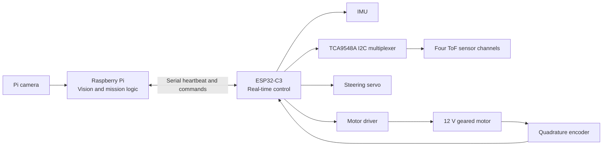
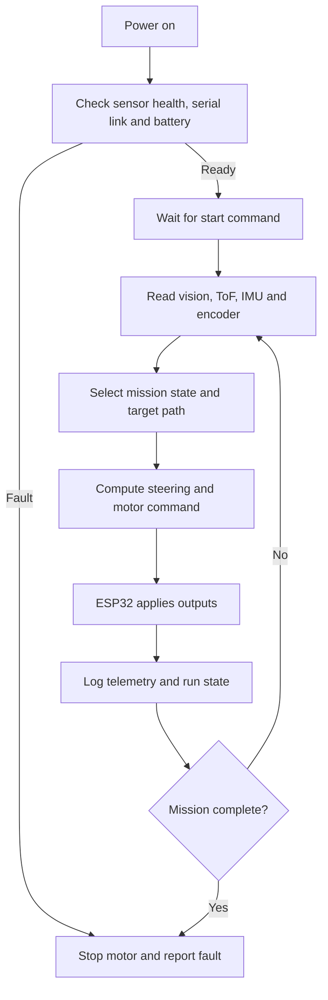

# YO_ERROR-404 Future Engineers V2 engineering journal

## Document purpose

This document records the proposed Version 2 of the YO_ERROR-404 Future Engineers robot. It is a build and test record, not a claim of final competition performance. Measurements, component ratings and run results must be recorded during validation before being presented as achieved results.

Version 2 keeps the useful principle of the existing robot: a Raspberry Pi performs high-level vision while an ESP32 handles time-critical sensing and actuation. V2 changes the mechanical platform and makes the power, sensing and test process more deliberate.

| Journal section | Evidence to add before final submission |
| --- | --- |
| Robot views | Front-left, top, right-side, wiring and underside photographs |
| Mechanical design | Chosen STL revision, material, print settings and dry-fit record |
| Electrical design | Wiring diagram, power measurements and current test record |
| Software design | Command protocol, calibration file and tested source revision |
| Validation | Dated run log with failures, corrections and repeat results |

## Image evidence

> **Image reserved - V2 complete robot** 
> Add the final front-left photograph at `media/images/v2/robot-front-left.jpg`.

> **Image reserved - V2 labelled top view** 
> Add the component-layout photograph at `media/images/v2/robot-top.jpg`.

> **Image reserved - V2 power and wiring view** 
> Add the electrical-layout photograph at `media/images/v2/robot-wiring.jpg`.

## Why move from V1 to V2

The existing repository describes a compact prototype using a BO motor, HC-SR04 ultrasonic sensors, a 9 V supply and a basic front-steering chassis. That platform is useful for early software work, but it limits repeatability on a WRO field.

V2 is intended to solve the following problems:

| V1 limitation | V2 response | Expected benefit |
| --- | --- | --- |
| BO motor and light drivetrain | 12 V geared motor with quadrature encoder and differential drivetrain | More repeatable speed and distance control |
| Ultrasonic sensors have a broad acoustic cone | Four short-range ToF sensors on a TCA9548A I2C multiplexer | More precise wall-distance data at the required sensor positions |
| Small chassis has limited mounting rigidity | 6 mm polycarbonate chassis with printed PETG mounts and bearing supports | Better alignment, easier servicing and less vibration |
| One general power path | Separate motor, servo and logic power domains with a common ground | Lower risk of controller reset during motor or servo load |
| Open-loop driving adjustments | Encoder, IMU, ToF and camera data used as feedback | Better recovery from drift and course variation |

## V2 design goals

- Fit within the current WRO Future Engineers size and safety rules. Confirm the official rulebook before final fabrication.
- Keep the centre of gravity low and keep steering, drivetrain and sensing mounts serviceable.
- Measure distance and heading rather than relying only on time-based movement.
- Build in stages so each subsystem can be tested alone before full-course testing.
- Store source code, calibration values, wiring photographs and STL revisions together.

## System architecture

The Raspberry Pi owns image capture, colour/obstacle interpretation and the high-level state machine. The ESP32-C3 owns sensor polling, encoder counting, PWM output, safe-stop behaviour and serial telemetry. The two controllers must share a documented command protocol and a common electrical ground.

## Control-loop flow

## Mechanical design

### Chassis and steering

The local V2 manufacturing library contains a 6 mm chassis body, front-axle support, side-bearing mounts, steering couplers, camera mounts and differential supports. These parts support a rear differential drivetrain and servo-actuated front steering.

Print structural mounts in PETG, not PLA, when they carry motor, steering, bearing or camera loads. PETG provides better heat resistance and layer adhesion during repeated vibration testing. Use heat-set inserts or locknuts where a screw must be removed repeatedly.

Before printing a final set, check the following against the physical parts:

- motor body length, shaft diameter and coupling engagement;
- differential holder and bearing fit;
- steering travel without wheel or chassis interference;
- camera and sensor field of view;
- encoder clearance and cable bend radius.

### STL release

The `hardware/STL_V2/` folder contains the 31 root-level STL files supplied for this V2 release. It intentionally excludes STEP, STP, DXF, 3MF, F3D and image files. Several filenames describe older or alternate iterations; treat them as a fabrication library, not proof that every file belongs in the final assembly.

The final build should have a short bill of materials that maps each fitted component to one STL filename, material, infill, nozzle size and tested revision.

## Electrical and power architecture

| Domain | Proposed supply | Loads | Verification before integration |
| --- | --- | --- | --- |
| Motor | 12 V battery rail | Geared motor and motor driver | Measure free-run, loaded and brief stall-current limits |
| Servo | Dedicated regulated rail within the servo rating | Steering servo | Confirm voltage under full steering load |
| Logic | Regulated 5 V rail | Raspberry Pi and ESP32-C3 VIN/USB | Confirm no brownout when motor and servo operate |
| Sensors | Clean 3.3 V rail | ToF sensors, multiplexer and IMU | Confirm voltage and I2C stability under PWM noise |

All domains require a common ground at a planned star point. Route motor and servo current away from the IMU and I2C wiring. Use a main fuse, a physical power switch and strain relief on battery wires.

### Motor-driver decision

The intended 900 RPM Johnson motor with encoder must be matched to a motor driver using measured current, not nominal voltage alone. The Vikram-453R6 is rated below the motor listing's maximum load-current value, so it must not be accepted for V2 until current limiting and real drivetrain current have been verified. A driver with enough continuous-current margin, such as a 10 A-class option, is the safer initial test choice.

## Sensing and control

### ToF array

Four identical VL53L0X-style sensors start at the same I2C address. V2 uses a TCA9548A multiplexer so the ESP32 can isolate each sensor channel. During bench testing, record readings at known distances and save per-sensor offsets in configuration.

Place sensors only after verifying that the surrounding mount does not block their field of view. If the field environment shows unreliable close-range readings, retain an alternative mount for a single side-facing TFmini-style sensor rather than changing the full design at the event.

### Motion feedback

The quadrature encoder provides wheel-speed and distance feedback. The IMU provides heading feedback. Use the encoder to avoid timing-only distance estimates, and use the IMU to detect accumulated heading error. Calibration values must be kept in a versioned configuration file, not buried in code.

### Software responsibilities

| Raspberry Pi | ESP32-C3 |
| --- | --- |
| Camera capture and image processing | ToF, IMU and encoder polling |
| Open/Obstacle round state machine | Motor PWM, direction and steering PWM |
| High-level target selection | Low-level safety stop and telemetry |
| Log run outcome and visual confidence | Report distances, heading, counts and faults |

The serial protocol should include a heartbeat, an explicit STOP command and a defined response when communication is stale. The ESP32 must stop propulsion on sensor failure, stale command input or an explicit stop request.

## Version 2 advantages

1. A more rigid differential platform improves repeatability of steering and wheel alignment.
2. Encoder feedback gives a measurable basis for speed and distance calibration.
3. Four ToF channels provide coverage at front, left, right and rear locations when the mounts are validated.
4. Separating motor, servo and logic power reduces reset and noise risk.
5. The STL-only release makes fabrication accessible without exposing editable CAD source files.
6. The Pi-plus-ESP32 split keeps image work away from real-time motor and sensor tasks.

## Learnings carried from V1

- Test one hardware subsystem at a time before joining it to the full robot.
- Mechanical alignment and cable routing affect reliability as much as code does.
- A sensor reading is only useful after mounting, lighting and field conditions have been tested.
- Calibrations must be written down and backed up after every successful run.
- Avoid a large code or hardware change immediately before a competition run.
- Keep a safe-stop path independent of the high-level vision process.

## Validation plan

| Stage | Test | Acceptance evidence |
| --- | --- | --- |
| Mechanical | Roll test, steering sweep and coupling inspection | No binding, rub or loose fasteners |
| Power | Motor/servo load test with logic rail monitored | No reset or unsafe heat |
| Sensors | ToF readings at known distances and IMU heading check | Saved offsets and repeatable readings |
| Drive | Straight 1 m runs and repeated turns | Logged distance and heading error |
| Vision | Red/green object tests under the event lighting | Saved frames and confidence observations |
| Full system | Repeated Open and Obstacle round practice | Run log, failure reason and targeted fix |

## Release contents

- `hardware/STL_V2/`: STL fabrication library supplied for V2.
- `src/`: existing ESP32 and Raspberry Pi code snapshots. These require pin, protocol and calibration updates before being treated as V2-final firmware.
- `docs/V2_ENGINEERING_JOURNAL.md`: V2 design basis, risks and validation plan.

## Security and repository hygiene

Do not commit GitHub tokens, Wi-Fi passwords, event credentials or personal data. Keep local credentials in an ignored configuration file and commit only an example template with placeholder values. Add generated logs, video captures and large raw datasets only when they are needed for reproducible testing.
