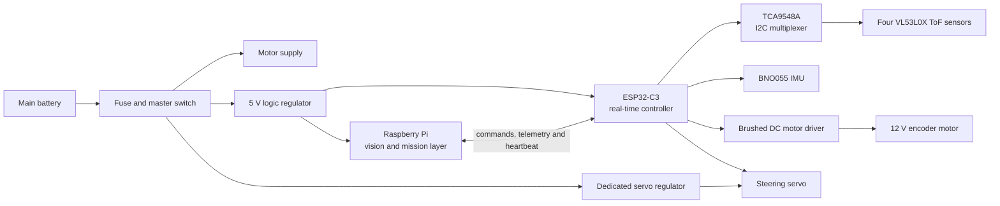

# Version 2 electronics reference

This folder records the intended Version 2 electronics architecture for YO_ERROR-404. It is a build reference, not a claim that every component below has already been installed. Confirm the exact board labels, connector polarity, current ratings and pin assignments on the physical robot before powering the system.

The structure was informed by the team engineering journal's approach to separating vision, real-time control, sensing and power. This document has been written independently for the Version 2 design.

## Architecture



## Component register

| Subsystem | Target Version 2 component | Purpose | Interface | Supply | Before installation |
| --- | --- | --- | --- | --- | --- |
| Mission computer | Raspberry Pi 5, 4 GB or compatible fitted board | Camera processing and navigation decisions | Camera interface and serial link | Regulated 5 V | Measure rail voltage while the camera and processor are active. |
| Camera | Wide-angle Raspberry Pi camera | Detect course features and objects | Camera interface | From Raspberry Pi | Check focus, field of view and secure the cable. |
| Real-time controller | ESP32-C3 development board | Poll sensors, drive outputs and handle safety checks | I2C, PWM, GPIO and serial | 5 V input / board 3.3 V logic | Record the exact board revision before choosing pins. |
| Distance sensing | 4 x VL53L0X time-of-flight sensor | Measure front, left, right and rear clearance | I2C through multiplexer | 3.3 V | Test each channel and record its mounting offset. |
| I2C expansion | TCA9548A multiplexer | Gives each same-address ToF sensor an individual bus channel | I2C | 3.3 V | Scan all channels before fitting the sensors. |
| Orientation sensing | BNO055 IMU | Heading reference for turn correction | I2C | 3.3 V | Mount away from motor wiring and calibrate after final assembly. |
| Drive output | Brushed DC H-bridge rated for the measured motor current | Controls the 12 V encoder motor | PWM/direction or driver-specific inputs | Motor rail | Test free-run, stall-protected and loaded current before selecting the final driver. |
| Drive feedback | Encoder integrated with the geared motor | Speed and distance feedback | ESP32-C3 digital inputs | Match encoder specification | Verify channel order and counts per wheel revolution. |
| Steering output | High-torque digital steering servo | Turns the front steering mechanism | PWM | Dedicated regulated servo rail | Confirm its voltage range and check for brownouts at full steering load. |
| Logic power | Regulated 5 V DC-DC converter | Powers Raspberry Pi and controller electronics | Power rail | Main battery to 5 V | Confirm capacity with all logic loads enabled. |
| Servo power | Adjustable DC-DC regulator matching the fitted servo | Supplies steering without loading the logic rail | Power rail | Main battery to servo voltage | Set the voltage with a meter before connecting the servo. |
| Protection | Main fuse, master switch and correctly sized wiring | Isolates the robot and limits fault current | Power path | Main battery | Place the fuse close to the battery positive terminal. |

## Communications and control boundary

The Raspberry Pi owns mission decisions such as target speed and steering demand. The ESP32-C3 owns the time-sensitive work: sensor polling, motor/servo outputs, encoder capture and safety stop behaviour.

Use one documented serial protocol between them. A simple Version 2 format can be:

```text
CMD,<speed>,<steering>,<state>
TEL,<front>,<left>,<right>,<rear>,<yaw>,<encoder>,<health>
```

The ESP32-C3 should stop propulsion when commands are stale, a sensor check fails or the controller resets. Confirm this behaviour with the wheels lifted before every field test.

## Power and wiring rules

1. Run the motor, servo and logic rails from the protected battery input, with each regulator sized for its real load.
2. Join grounds at a planned common reference point so signal levels are valid, while keeping high-current motor and servo wiring short and separate from I2C and IMU wiring.
3. Keep the IMU away from the motor, motor driver, battery leads and steel fasteners where possible.
4. Add strain relief to the camera cable, battery connector and motor-driver terminals.
5. Measure voltage at the Raspberry Pi and ESP32-C3 while steering and driving are active. Any reset or sensor dropout blocks field testing until corrected.

## Pin-map worksheet

Choose the final pins only after the exact ESP32-C3 board and motor driver are on the bench. Keep this table updated as the wiring changes.

| Function | Final ESP32-C3 pin | Connected device | Bench-test result |
| --- | --- | --- | --- |
| I2C clock | To be assigned | TCA9548A and BNO055 | Pending |
| I2C data | To be assigned | TCA9548A and BNO055 | Pending |
| Motor PWM | To be assigned | Motor driver | Pending |
| Motor direction | To be assigned | Motor driver | Pending |
| Steering PWM | To be assigned | Steering servo | Pending |
| Encoder channel A | To be assigned | Encoder motor | Pending |
| Encoder channel B | To be assigned | Encoder motor | Pending |
| Raspberry Pi serial link | To be assigned | Raspberry Pi | Pending |

## Bring-up order

1. Inspect polarity, fuse, switch operation and mechanical cable clearance with the battery disconnected.
2. Power the regulators without controllers attached and measure the output rails.
3. Power the Raspberry Pi and ESP32-C3, then confirm stable serial communication.
4. Scan the I2C bus, test each ToF channel, and record IMU heading output.
5. Test steering with wheels off the ground, then verify motor direction and encoder counts at low speed.
6. Run the safety-stop test by removing the command heartbeat and by introducing a sensor fault.

## Evidence to retain

| Check | Record |
| --- | --- |
| Power validation | Battery voltage, each regulated voltage and loaded readings |
| Motor sizing | Free-run and loaded current observations, driver temperature |
| Sensor validation | ToF channel scan, measured offsets and IMU calibration status |
| Control validation | Serial log, steering limits, encoder direction and safe-stop result |

### Source note

This is an original V2 build reference informed by the architecture themes in `Yo_Error_404_Engineering_Journal (1).pdf`. It intentionally does not reproduce the journal's wording, diagrams, images or pin map.
