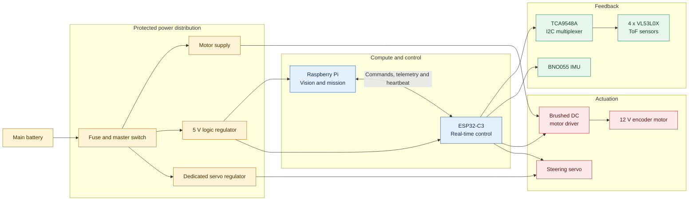

<div align="center">

# Version 2 Electronics

### YO_ERROR-404 · WRO Future Engineers 2026

| Design status | Control layout | Build record |
| :---: | :---: | :---: |
| **Integration reference** | Raspberry Pi + ESP32-C3 | Update after each bench test |

</div>

> [!IMPORTANT]
> This is the Version 2 electronics build reference. Confirm board labels, connector polarity, current ratings and final pin assignments on the physical robot before powering it.

| [Architecture](#system-architecture) | [Components](#component-register) | [Wiring](#power-and-wiring) | [Pins](#pin-map-worksheet) | [Bring-up](#bench-bring-up) |
| :---: | :---: | :---: | :---: | :---: |

---

## System architecture



| Decision layer | Raspberry Pi processes camera input and chooses the mission action. |
| --- | --- |
| Real-time layer | ESP32-C3 reads feedback, drives motor and steering outputs, and applies safety behaviour. |
| Power principle | Motor, steering and logic are supplied from protected branches with a planned common ground. |

---

## Component register

### Compute and sensing

| Component | Role | Interface | Supply | Integration check |
| --- | --- | --- | --- | --- |
| **Raspberry Pi 5, 4 GB** or compatible fitted board | Camera processing and navigation decisions | Camera interface and serial link | Regulated 5 V | Measure rail voltage while camera and processor are active. |
| **Wide-angle Raspberry Pi camera** | Detect course features and objects | Camera interface | From Raspberry Pi | Check focus, field of view and cable retention. |
| **ESP32-C3 development board** | Sensor polling, PWM, telemetry and safety checks | I2C, PWM, GPIO and serial | 5 V input / 3.3 V logic | Record the exact board revision before choosing pins. |
| **4 x VL53L0X ToF sensors** | Front, left, right and rear clearance measurement | I2C through multiplexer | 3.3 V | Test every channel and record its mounting offset. |
| **TCA9548A multiplexer** | Separates same-address ToF sensors into I2C channels | I2C | 3.3 V | Scan all channels before fitting sensors. |
| **BNO055 IMU** | Heading reference for turn correction | I2C | 3.3 V | Mount away from high-current wiring and calibrate after final assembly. |

### Motion and power

| Component | Role | Interface | Supply | Integration check |
| --- | --- | --- | --- | --- |
| **Brushed DC H-bridge** sized for measured motor current | Controls the 12 V encoder motor | PWM/direction or driver-specific inputs | Motor rail | Test free-run, protected stall and loaded current before selecting the final driver. |
| **Encoder geared motor** | Rear propulsion with speed and distance feedback | Motor output and ESP32-C3 digital inputs | 12 V motor rail; encoder per specification | Verify channel order and counts per wheel revolution. |
| **High-torque digital steering servo** | Turns the front steering mechanism | PWM | Dedicated regulated servo rail | Confirm voltage range and check for brownouts at full steering load. |
| **5 V DC-DC regulator** | Powers Raspberry Pi and controller electronics | Power rail | Main battery to 5 V | Confirm capacity with all logic loads enabled. |
| **Adjustable servo regulator** | Supplies steering without loading the logic rail | Power rail | Main battery to servo voltage | Set voltage with a meter before connecting the servo. |
| **Fuse, master switch and correctly sized wiring** | Isolates the robot and limits fault current | Power path | Main battery | Place the fuse close to the battery positive terminal. |

> [!NOTE]
> The final motor-driver model, servo model and all regulator ratings must match the measured load and the hardware actually fitted to Version 2.

---

## Communication boundary

The Raspberry Pi sends the requested vehicle action. The ESP32-C3 owns time-sensitive sensing, encoder capture, motor/servo outputs and safe stopping.

```text
COMMAND  CMD,<speed>,<steering>,<state>
TELEMETRY TEL,<front>,<left>,<right>,<rear>,<yaw>,<encoder>,<health>
```

> [!CAUTION]
> Stop propulsion whenever commands become stale, a sensor-health check fails, or the controller resets. Test this with the wheels raised before every field run.

---

## Power and wiring

| Rule | Implementation evidence |
| --- | --- |
| Protected input | Use a main fuse and master switch before the regulator branches. |
| Separate load paths | Keep motor, steering and logic supplies on their intended protected branches. |
| Common reference | Join grounds at one planned reference point so signal levels remain valid. |
| Noise control | Keep high-current motor and servo leads short and away from I2C and IMU wiring. |
| Mechanical reliability | Add strain relief to the camera cable, battery connector and motor-driver terminals. |
| Loaded-voltage test | Measure voltage at the Raspberry Pi and ESP32-C3 while steering and driving are active. |

Any reset or sensor dropout during the loaded-voltage test must be fixed before field testing.

---

## Pin-map worksheet

Assign final pins only after the exact ESP32-C3 board and motor driver are on the bench.

| Function | ESP32-C3 pin | Connected device | Bench result |
| --- | :---: | --- | :---: |
| I2C clock | To be assigned | TCA9548A and BNO055 | Pending |
| I2C data | To be assigned | TCA9548A and BNO055 | Pending |
| Motor PWM | To be assigned | Motor driver | Pending |
| Motor direction | To be assigned | Motor driver | Pending |
| Steering PWM | To be assigned | Steering servo | Pending |
| Encoder channel A | To be assigned | Encoder motor | Pending |
| Encoder channel B | To be assigned | Encoder motor | Pending |
| Raspberry Pi serial link | To be assigned | Raspberry Pi | Pending |

---

## Bench bring-up

| Step | Task | Completion evidence |
| :---: | --- | --- |
| 01 | Inspect polarity, fuse, switch operation and cable clearance with battery disconnected. | Visual inspection complete. |
| 02 | Power regulators with controllers disconnected and measure every rail. | Voltage readings recorded. |
| 03 | Power Raspberry Pi and ESP32-C3, then confirm stable serial communication. | Command and telemetry log saved. |
| 04 | Scan I2C, test each ToF channel and check IMU heading output. | Sensor scan and calibration record saved. |
| 05 | Test steering with wheels raised; then verify motor direction and encoder counts at low speed. | Steering, motor and encoder checks passed. |
| 06 | Remove the command heartbeat and introduce a sensor fault. | Safe stop confirmed. |

## Evidence to retain

| Area | Record |
| --- | --- |
| Power validation | Battery voltage, regulator voltages and loaded readings |
| Motor sizing | Free-run and loaded current observations; driver temperature |
| Sensor validation | ToF channel scan, measured offsets and IMU calibration status |
| Control validation | Serial log, steering limits, encoder direction and safe-stop result |

---

<sub>Original Version 2 build reference informed by the architecture themes in <code>Yo_Error_404_Engineering_Journal (1).pdf</code>. It does not reproduce the journal's wording, diagrams, images or pin map.</sub>
